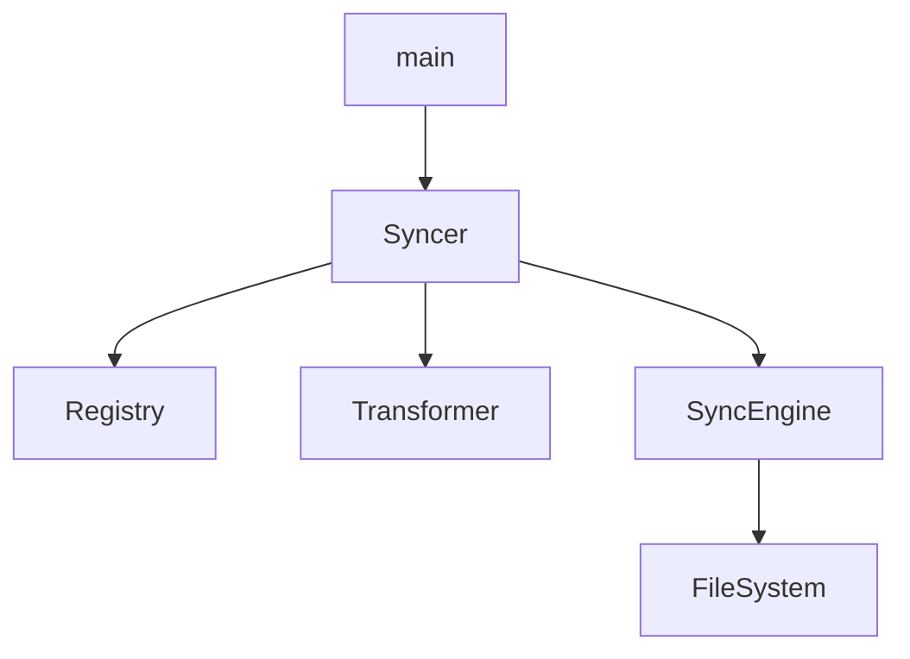

# DESIGN: `agb sync` (Source-Target Synchronization)

## 1. 개요 (Objective)
`agb build` 과정에서 생성된 타겟 에이전트 작업 환경(`dest`)의 변경사항(프롬프트 수정, 설명 변경, 스킬 내 파일 추가/삭제 등)을 원본 소스 저장소(`source`)에 안전하고 정확하게 반영하는 기능을 설계합니다.

## 2. 핵심 설계 원칙 (Core Principles)
- **진실의 원천(SSOT) 보호**: `agb.yaml`을 통한 리소스 관리 규칙은 유지하며, 타겟에서 발생한 "내용적" 변경만 소스에 흡수합니다.
- **부분적 업데이트 (Partial Update)**: `.md` 파일의 메타데이터 수정 시, YAML 라이브러리를 사용하지 않고 라인 단위 교체 방식을 통해 원본 파일의 주석이나 포맷을 최대한 보존합니다.
- **포괄적 스킬 동기화 (Full Skill Sync)**: 스킬 디렉터리 내의 `ExtraFiles`는 추가, 삭제, 수정을 모두 감지하여 소스와 동기화합니다.
- **안전한 제외 (Safe Exclusion)**: `agb.yaml`의 `exclude` 패턴을 준수하고, 메인 지침 파일(`GEMINI.md` 등)은 동기화 대상에서 제외합니다.

## 3. 시스템 아키텍처 및 흐름 (Architecture)

### 3.1. 동기화 파이프라인
1. **Registry 로딩**: 기존 `Loader`를 사용해 소스 기준의 `Registry`를 구축합니다. 이때 각 `Resource`는 원본 소스 파일의 절대 경로 정보를 포함해야 합니다.
2. **타겟 리소스 역변환 (De-transformation)**: `dest`에 있는 출력물(TOML, MD 등)을 읽어 내부 `ResourceData` 모델로 복원합니다.
3. **비교 (Diff)**:
    - **Metadata**: `description` 필드만 비교.
    - **Content**: 전체 텍스트 비교.
    - **ExtraFiles**: 해시(SHA-256) 기반 비교 및 디렉터리 스캔을 통한 추가/삭제 감지.
4. **반영 (Apply)**: 변경사항이 발견된 경우 소스 파일을 업데이트합니다.

### 3.2. 모듈 구조 (Module Structure)



- **`syncer::Syncer`**: 전체 동기화 공정을 오케스트레이션합니다.
- **`transformer::Transformer::detransform`**: 타겟 파일을 다시 `ResourceData`로 복원합니다.
- **`syncer::diff`**: 소스와 타겟의 차이점을 분석하고 변경 이벤트를 생성합니다.
- **`syncer::apply`**: 변경 이벤트를 소스 파일 시스템에 물리적으로 적용합니다.

## 4. 데이터 모델 변경 (Data Model Changes)

### 4.1. `core::model::ResourceData`
리소스의 소스 위치를 추적하기 위해 `source_path` 필드를 추가합니다.

```rust
pub struct ResourceData {
    pub name: String,
    pub plugin: String,
    pub content: String,
    pub metadata: Value,
    pub source_path: PathBuf, // 신규 추가: 원본 소스 위치
}
```
- **Command / Agent**: 해당 `.md` 파일의 절대 경로.
- **Skill**: 해당 스킬 디렉터리의 절대 경로. (`SKILL.md`는 `source_path/SKILL.md`로 접근)

### 4.2. `core::model::SkillData`
추가적인 경로 필드 없이 `base.source_path`를 스킬 디렉터리 경로로 활용합니다.

```rust
pub struct SkillData {
    pub base: ResourceData,
    pub extras: Vec<ExtraFile>,
}
```

## 5. 상세 구현 전략 (Detailed Strategies)

### 5.1. Metadata Partial Update (`.md`)
원본 마크다운 파일의 Frontmatter 영역에서 `description:` 키를 찾아 해당 라인만 교체합니다.

```rust
// 예시 로직 (Pseudo-code)
fn update_description(source_content: &str, new_desc: &str) -> String {
    // 1. Frontmatter 영역(--- 사이) 추출
    // 2. regex 또는 line-by-line으로 "description: ..." 패턴 찾기
    // 3. 해당 라인을 "description: <new_desc>"로 교체 (주석 유지 고려)
    // 4. 전체 내용 재조합
}
```

### 5.2. Skill ExtraFiles Sync
스킬 디렉터리의 `dest`와 `source` 상태를 일치시키기 위해 다음 로직을 수행합니다.

- **`dest`에만 있는 파일**: `source`로 복사. 단, `exclude` 패턴 매칭 시 무시 및 로그 출력.
- **`source`에만 있는 파일**: `source`에서 삭제 (Registry에 등록된 리소스의 `extras` 목록과 대조).
- **양쪽에 있는 파일**: SHA-256 해시 비교 후 다르면 `dest` -> `source` 복사.

### 5.3. Transformer 역변환 (Detransform)
- **`Transformer::detransform(resource_type, file_content)`** 인터페이스 추가.
- **Gemini Commands (`.toml`)**: `toml` 크레이트로 파싱. `description` 필드와 `prompt` 필드를 추출하여 `ResourceData`로 복원합니다.
- **Default/MD (`.md`)**: `extract_frontmatter`를 사용해 파싱. `metadata.description`과 `pure_content`를 추출하여 `ResourceData`로 복원합니다.

## 6. 제약 및 예외 사항
- **중단점**: 타겟 파일이 파싱 불가능하거나 손상된 경우, 해당 리소스의 동기화는 실패 처리하고 에러 로그를 남긴 후 다음 리소스로 진행합니다.
- **제외 파일**: `GEMINI.md`, `CLAUDE.md`, `AGENTS.md` 등은 명시적으로 무시합니다.
- **보안**: `source` 경로 외부의 파일을 수정하거나 삭제하지 않도록 절대 경로 검증을 수행합니다.
