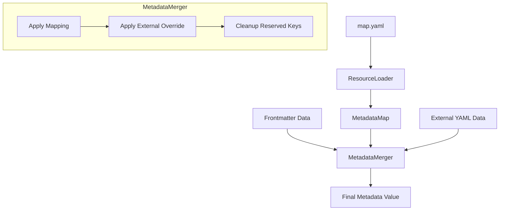

# DESIGN: Metadata Map & Refactoring

## 1. 개요 (Overview)

본 설계는 단일 마크다운 소스의 Frontmatter 필드 값을 빌드 타겟 에이전트에 따라 동적으로 변환하는 `Metadata Map` 기능을 정의합니다. 또한, 기존 `ResourceParser`에 집중되어 있던 메타데이터 병합 및 가공 로직을 별도의 `MetadataMerger` 모듈로 분리하여 코드의 응집도를 높이고 유지보수성을 개선합니다.

## 2. 주요 변경 사항 (Key Changes)

### 2.1. 신규 모듈: `MetadataMerger` (`src/loader/merger.rs`)
- **역할**: Frontmatter, Metadata Map, 그리고 외부 메타데이터 파일의 데이터를 하나로 통합하고 가공하는 단일 책임 모듈입니다.
- **주요 기능**:
    - `MetadataMap` 기반 필드 값 치환.
    - 타겟 에이전트 전용 섹션 오버라이트 (기존 `merge_metadata` 이관).
    - 병합 시 제약 사항(필드명 검증 등) 처리.

### 2.2. 데이터 모델 확장 (`src/core/model.rs`)
- **`MetadataMap`**: 소스 루트의 `map.yaml` 구조를 표현하는 데이터 모델을 추가합니다.
- **구조 (Conceptual)**:
  ```rust
  pub struct MetadataMap {
      // Field Name -> (Original Value -> (Target -> Mapped Value))
      pub mappings: HashMap<String, HashMap<String, HashMap<BuildTarget, String>>>,
  }
  ```

### 2.3. 리소스 로더 및 파서 리팩터링
- **`ResourceLoader`**: 소스 루트에서 `map.yaml` 파일 존재 여부를 확인하고 로드하여 컨텍스트에 유지합니다.
- **`ResourceParser`**: 직접 병합 로직을 수행하는 대신 `MetadataMerger` 인스턴스를 사용하여 최종 메타데이터를 획득합니다.

## 3. 메타데이터 매핑 및 병합 규격

### 3.1. 매핑 규칙 (Mapping Rules)
- **계층 구조**: `[Field Name] -> [Original Value] -> [Target Agent] -> [Mapped Value]`
- **대상 제약**:
    - 필드 값이 `string`인 경우에만 적용.
    - 필드 이름이 `description`인 경우 매핑 대상에서 제외.
- **Fallback**: 매핑 정의가 없거나 현재 타겟에 대한 값이 없는 경우 원본 값을 유지합니다.

### 3.2. 병합 우선순위 (Merge Priority)
최종 메타데이터 값은 다음 우선순위에 따라 결정됩니다 (높은 번호가 최종 우선순위).

1.  **Markdown Frontmatter (Base)**: 원본 소스 파일의 기본 설정.
2.  **Metadata Map**: `map.yaml`에 정의된 매핑에 따른 변환 값.
3.  **외부 메타데이터 파일 ([name].yaml)**: 타겟 전용 섹션(`gemini-cli` 등)의 명시적 오버라이트.

## 4. 데이터 흐름 (Data Flow)



## 5. 상세 구현 가이드

### 5.1. Metadata Map 파싱
- 파일 위치: `[Source Root]/map.yaml`
- 파싱 시 에러 처리: 파일이 없으면 매핑 단계 건너뜀. 형식이 잘못되면 빌드 에러 발생.

### 5.2. MetadataMerger 인터페이스
```rust
pub struct MetadataMerger<'a> {
    target: BuildTarget,
    map: Option<&'a MetadataMap>,
}

impl<'a> MetadataMerger<'a> {
    pub fn merge(
        &self,
        base: Value,
        external: Option<&Value>,
    ) -> Result<Value> {
        let mut result = base;
        
        // 1. Metadata Map 적용
        if let Some(map) = self.map {
            self.apply_mapping(&mut result, map)?;
        }
        
        // 2. 외부 YAML 병합
        if let Some(ext) = external {
            self.apply_external_override(&mut result, ext)?;
        }
        
        // 3. 예약어 정리
        self.cleanup(&mut result);
        
        Ok(result)
    }
}
```

## 6. 매핑 예시 (Mapping Example)

구현 에이전트의 이해를 돕기 위한 구체적인 매핑 시나리오입니다.

### 6.1. `map.yaml` 설정 (Source Root)
```yaml
model:
  sonnet:
    gemini-cli: gemini-3.0-flash
    claude-code: sonnet
    opencode: glm-4.6
  opus:
    gemini-cli: gemini-3.0-pro
    claude-code: opus
    opencode: glm-4.7
```

### 6.2. 원본 리소스 (`plugins/my_plugin/agents/researcher.md`)
```markdown
---
name: researcher
model: sonnet
description: 전문 연구원 에이전트입니다.
---
# Researcher Profile
...
```

### 6.3. 타겟별 변환 결과 (Metadata Mapping)

#### 빌드 타겟: `gemini-cli`
- **프로세스**: 
  1. `model` 필드 값이 `sonnet`임을 확인.
  2. `map.yaml`에서 `model` -> `sonnet` -> `gemini-cli` 경로의 값인 `gemini-3.0-flash`를 추출.
  3. `description` 필드는 제약 조건에 따라 매핑을 수행하지 않음.
- **최종 메타데이터**:
  ```json
  {
    "name": "researcher",
    "model": "gemini-3.0-flash",
    "description": "전문 연구원 에이전트입니다."
  }
  ```

#### 빌드 타겟: `opencode`
- **프로세스**: 
  1. `model` -> `sonnet` -> `opencode` 경로의 값인 `glm-4.6`을 추출.
- **최종 메타데이터**:
  ```json
  {
    "name": "researcher",
    "model": "glm-4.6",
    "description": "전문 연구원 에이전트입니다."
  }
  ```

#### 매핑 실패 케이스 (Fallback)
- 만약 원본의 `model` 값이 `haiku`인데 `map.yaml`에 `haiku` 정의가 없다면, 원본 값 `haiku`를 그대로 유지합니다.
- 만약 `map.yaml`에 `sonnet` 정의는 있지만 `opencode` 타겟에 대한 값이 누락되었다면, 원본 값 `sonnet`을 유지합니다.
