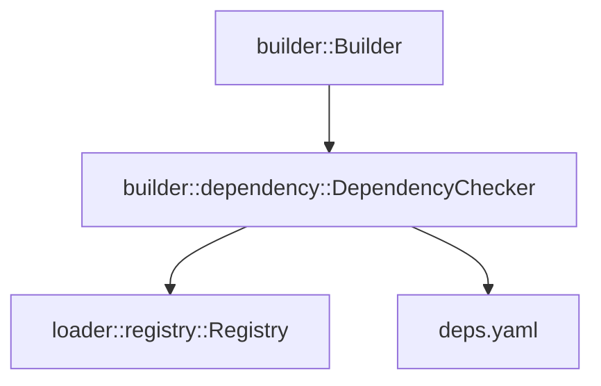

# DESIGN: Build-time Resource Dependency Check

## 1. 개요 (Objective)
`agb build` 과정에서 리소스 간의 의존성(`deps.yaml`)을 검증하는 기능을 설계합니다. 특정 리소스가 다른 리소스를 필요로 할 때, 해당 의존성 리소스가 `agb.yaml`에 포함되어 빌드 대상(`Registry`)에 존재하는지 확인하여 빌드 무결성을 보장합니다.

## 2. 핵심 설계 원칙 (Core Principles)
- **명시적 의존성**: 각 플러그인 디렉터리 내의 `deps.yaml` 파일에 의존성을 정의합니다.
- **빌드 전용 검사**: 이 기능은 `build` 명령 실행 시에만 작동하며, `builder` 모듈 내부에서 수행됩니다.
- **비재귀적 검사**: 복잡성을 피하기 위해 1단계 의존성만 검사합니다. (`agb.yaml`에 모든 리소스가 명시되므로 개별 리소스의 의존성만 확인하면 충분함)
- **상세한 오류 리포팅**: 누락된 모든 의존성을 수집하여 한꺼번에 출력하고 빌드를 실패 처리합니다.
- **플러그인 및 타입 엄격 검증**: 의존성은 `plugin:name` 형식과 리소스 타입(복수형 키)을 모두 만족해야 합니다.

## 3. 시스템 아키텍처 및 흐름 (Architecture)

### 3.1. 의존성 검사 파이프라인
1. **Registry 구축**: `AppContext::init` 단계에서 `agb.yaml`을 기반으로 `Registry`가 완성됩니다.
2. **의존성 로딩**: `Builder` 실행 시, `Registry`의 각 리소스가 속한 플러그인 디렉터리에서 `deps.yaml`을 찾아 읽습니다.
3. **검증 (Validation)**:
    - 리소스의 타입과 이름으로 `deps.yaml` 내 정의를 찾습니다.
    - 정의된 의존성 리소스(`plugin:name` 및 타입)가 `Registry`에 존재하는지 확인합니다.
4. **결과 처리**: 모든 검사를 마친 후 누락된 항목이 있으면 상세 로그와 함께 `anyhow::Result` 에러를 반환합니다.

### 3.2. 모듈 구조 (Module Structure)



- **`builder::dependency::DependencyChecker`**: 의존성 검사 로직을 전담하는 신규 컴포넌트입니다.
- **`deps.yaml` 규격**:
  ```yaml
  [resource_type_plural]:
    [resource_name]:
      [dependency_type_plural]:
        - [plugin_name]:[resource_name]
  ```
  예시:
  ```yaml
  agents:
    skill-writer:
      skills:
        - general-documentation:general-documentation-guidelines
  ```

## 4. 데이터 모델 및 인터페이스 (Data Model & Interface)

### 4.1. `deps.yaml` 파싱 모델
```rust
#[derive(Debug, Deserialize)]
struct DependencyConfig {
    #[serde(flatten)]
    // Key: ResourceType (plural, e.g., "agents")
    // Value: Map<ResourceName, Map<DependencyType, Vec<PluginQualifiedName>>>
    types: HashMap<String, HashMap<String, HashMap<String, Vec<String>>>>,
}
```

### 4.2. `Registry` 확장
특정 식별자(`plugin:name`)와 타입을 가진 리소스의 존재 여부를 효율적으로 확인하기 위한 메서드를 추가합니다.

```rust
impl Registry {
    // 특정 타입과 식별자(plugin:name)를 가진 리소스가 있는지 확인
    pub fn contains_by_id(&self, r_type: ResourceType, plugin: &str, name: &str) -> bool;
}
```

## 5. 상세 구현 전략 (Detailed Strategies)

### 5.1. `DependencyChecker` 로직
- `Registry`의 모든 리소스를 순회합니다.
- 각 리소스의 `plugin` 정보를 바탕으로 `[source_dir]/plugins/[plugin]/deps.yaml` 경로를 생성합니다.
- `deps.yaml`이 존재하면 파싱하여 해당 리소스의 의존성 목록을 가져옵니다.
- 의존성 목록의 각 항목(`plugin:name`)이 `Registry`에 해당 타입으로 등록되어 있는지 `contains_by_id`로 확인합니다.
- 누락된 경우 `(SourceResource, MissingDependency)` 쌍을 수집합니다.

### 5.2. 오류 메시지 예시
```text
Build failed due to missing dependencies:
  - agent 'my_plugin:researcher' requires skill 'shared:web_search' (Not found in agb.yaml)
  - skill 'shared:web_search' requires command 'core:google' (Not found in agb.yaml)
```

## 6. 제약 및 예외 사항
- **파일 부재**: `deps.yaml`이 없는 플러그인은 의존성이 없는 것으로 간주합니다.
- **잘못된 형식**: `deps.yaml` 파싱 실패 시 빌드를 중단하고 에러를 발생시킵니다.
- **자기 참조**: 리소스가 자기 자신을 의존성으로 명시하는 경우도 허용되지만(이미 Registry에 있으므로 통과), 권장되지 않음을 로그로 알릴 수 있습니다.
