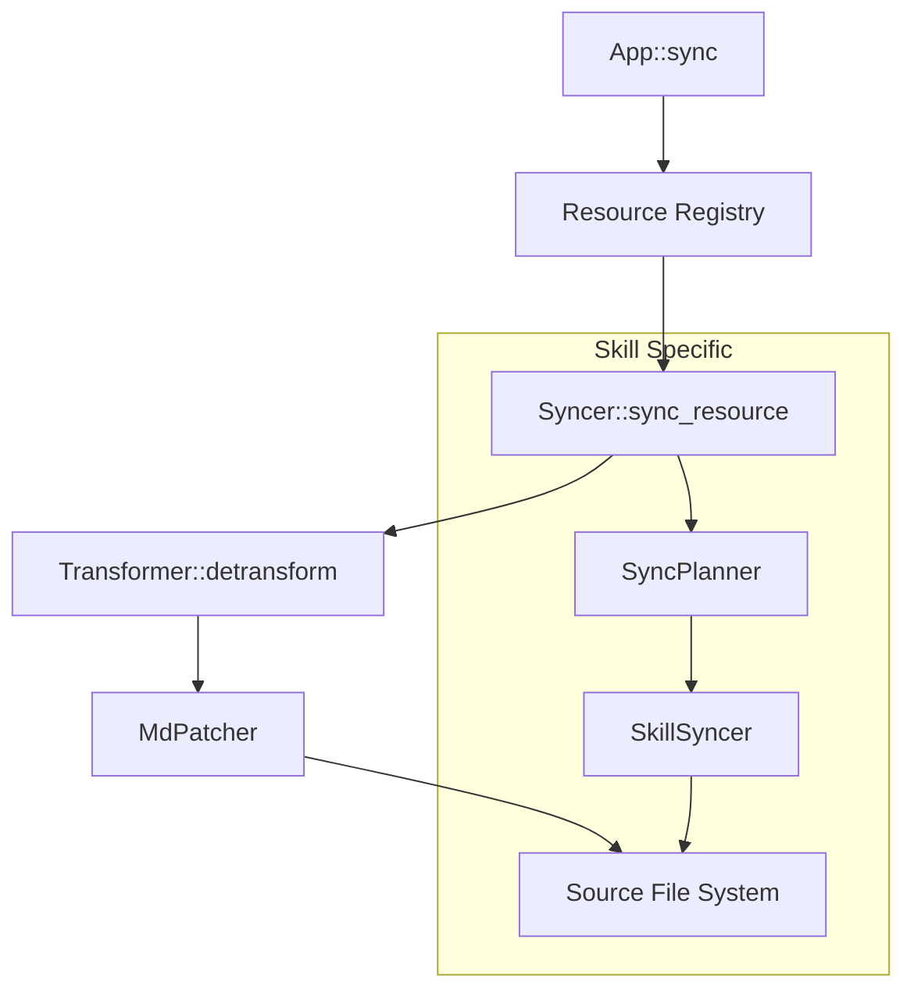

# DESIGN: Syncer 모듈 버그 수정 및 구조 개선

## 1. 개요
현재 `syncer` 모듈은 타겟의 변경사항을 소스로 역전파하는 과정에서 마크다운 구조 파괴, 비효율적인 경로 계산, 그리고 불완전한 메타데이터 동기화 문제를 가지고 있습니다. 본 설계는 이러한 버그들을 해결하고, 보다 견고하고 확장 가능한 동기화 메커니즘을 구축하는 것을 목표로 합니다.

## 2. 핵심 문제 분석 및 해결 전략

### 2.1 마크다운 본문 동기화 오류 (Skill 리소스)
- **문제**: `SyncPlanner`가 `SKILL.md`를 감지했을 때 원본(Raw) 내용을 전달하고, `SkillSyncer`가 이를 그대로 `MdPatcher::replace_body`에 전달함. 타겟이 Claude/OpenCode인 경우 본문 내에 타겟의 Frontmatter가 중첩되어 삽입되는 현상 발생.
- **해결**: `Syncer::sync_resource`와 유사하게 `SkillSyncer`에서도 `Transformer::detransform`을 호출하여 순수 본문과 메타데이터를 분리한 후 동기화 수행.

### 2.2 비효율적인 타겟 경로 계산
- **문제**: 타겟 파일의 경로를 알기 위해 `transformer.transform()` 전체 공정을 실행함. 이는 불필요한 연산 비용을 발생시킴.
- **해결**: `Transformer` 트레이트에 리소스 타입과 이름을 기반으로 타겟 경로만 반환하는 전용 메서드(`get_target_path`)를 추가하거나, `transform()`의 결과물에서 경로 정보만 안전하게 추출하는 로직으로 분리.

### 2.3 메타데이터 동기화 로직의 취약성
- **현황**: 의도대로 `description` 필드만 동기화하지만, 현재의 정규표현식 기반 방식은 멀티라인 YAML 값이나 주석이 섞인 경우 원본 마크다운의 구조를 깨뜨릴 위험이 있음.
- **해결**: `MdPatcher`가 `description` 키를 찾을 때 보다 정교한 패턴 매칭을 사용하도록 개선하여, 원본의 다른 메타데이터와 포맷을 완벽히 보존하면서 값만 안전하게 교체하도록 함.

### 2.4 코드 중복 및 일관성 부족
- **문제**: `skill.rs` 내부에 중복된 함수 정의 및 `SkillSyncer`와 `Syncer` 간의 책임 경계 모호.
- **해결**: `Syncer`를 중심으로 모든 리소스 유형(Command, Agent, Skill)의 동기화 흐름을 통합하고, `SkillSyncer`는 디렉터리 기반 파일 동기화에만 집중하도록 역할 재정의.

## 3. 변경된 데이터 흐름 및 아키텍처

## 4. 상세 설계 변경 사항

### 4.1 Transformer 인터페이스 확장
- `detransform` 메서드가 리소스의 메타데이터와 본문을 완벽하게 복원하도록 보장.
- 타겟 경로 계산 로직 최적화.

### 4.2 MdPatcher 개선
- **YAML 보존**: Frontmatter 내의 주석과 형식을 유지하면서 특정 키 값만 교체하는 로직 강화.
- **본문 교체**: Frontmatter와 Body 사이의 구분자(`---`) 처리를 더욱 정교하게 개선.

### 4.3 SyncPlanner 및 SkillSyncer 정제
- `SyncPlanner`는 파일의 추가/삭제/수정 상태만 식별.
- `SKILL.md`와 같은 특수 마크다운 파일의 동기화는 `Syncer`의 공통 로직을 재사용하도록 변경.
