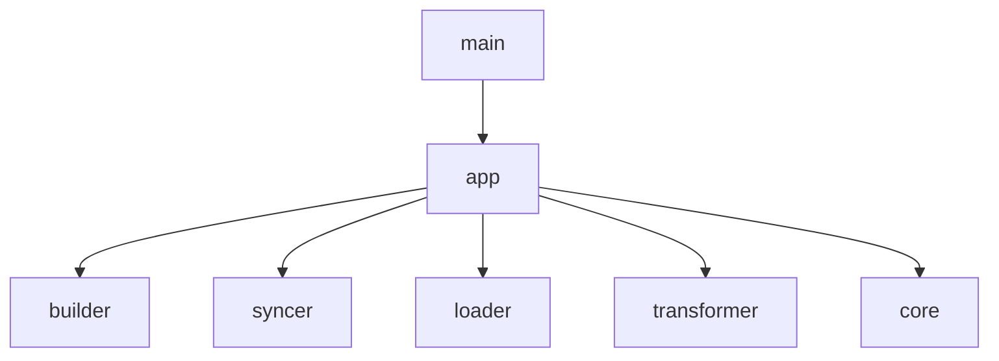

# Design: App Module Refactoring

## 1. 개요 (Overview)
현재 `src/main.rs`는 CLI 인자 파싱, 설정 로드, 레지스트리 구축, 트랜스포머 생성 및 명령어 분기 등 모든 실행 흐름을 직접 제어하고 있습니다. 이로 인해 `main.rs`가 비대해지고, 초기화 로직이 중복되며, 단위 테스트가 불가능한 구조를 가지고 있습니다.

이 설계는 **`app` 모듈**을 도입하여 실행 컨텍스트를 캡슐화하고, `main.rs`를 최소한의 진입점으로 축소하는 것을 목표로 합니다.

## 2. 변경된 아키텍처 (New Architecture)

### 2.1. AppContext 도입
명령어 실행에 필요한 모든 상태(Config, Registry, Transformer)를 `AppContext` 구조체로 캡슐화합니다.

```rust
// src/app/mod.rs
pub struct AppContext {
    pub config: Config,
    pub registry: Registry,
    pub transformer: Box<dyn Transformer>,
    pub source_dir: PathBuf,
    pub output_dir: PathBuf,
}
```

### 2.2. 모듈 구조 변경
- `src/main.rs`: `clap`을 이용한 CLI 파싱 및 `App::run` 호출만 담당.
- `src/lib.rs`: 모든 모듈(`app`, `core`, `loader`, `builder`, `syncer`, `transformer`, `utils`)을 선언하고 외부로 노출.
- `src/app/mod.rs`: `AppContext` 정의 및 초기화 로직, 명령어 분기 로직(App) 구현.

### 2.3. 의존성 그래프 (Dependency Graph)


## 3. 상세 설계 (Detailed Design)

### 3.1. `src/lib.rs` (신규)
모든 `mod` 선언을 `main.rs`에서 `lib.rs`로 이동하여 라이브러리 형태의 구조를 갖춥니다.

### 3.2. `src/app/mod.rs` (신규)
- `App` 구조체: 실행의 주체가 되며 `run(args)` 메서드를 제공합니다.
- `AppContext::init(config_path)`: 초기화 과정을 담당합니다.
- **오케스트레이션 로직**: `Registry`의 리소스들을 순회하며 `Builder`나 `Syncer`의 핵심 함수를 호출하는 로직을 `App` 내부 메서드(`build`, `sync`)로 통합합니다.

### 3.3. `src/builder/` 및 `src/syncer/` 변화
- 각 모듈의 `run` 메서드(반복문 포함)를 제거하거나 최소화합니다.
- 대신 단일 리소스를 처리하는 핵심 함수(`build_resource`, `sync_resource`)를 `pub`으로 노출하여 `App`에서 호출할 수 있게 합니다.

### 3.3. `src/main.rs` (축소)
```rust
fn main() -> anyhow::Result<()> {
    let cli = Cli::parse();
    let app = App::new();
    app.run(cli)
}
```

## 4. 기대 효과 (Benefits)
- **가독성 향상**: `main.rs`가 간결해지고 실행 흐름이 명확해집니다.
- **코드 재사용**: `AppContext`를 통해 초기화 로직을 일관되게 관리할 수 있습니다.
- **테스트 가능성**: 로직이 `App` 구조체 내부에 존재하므로, CLI 인자 없이도 통합 테스트를 작성하기 용이해집니다.
- **확장성**: 새로운 명령어를 추가할 때 `app` 모듈 내부에서 깔끔하게 확장할 수 있습니다.
