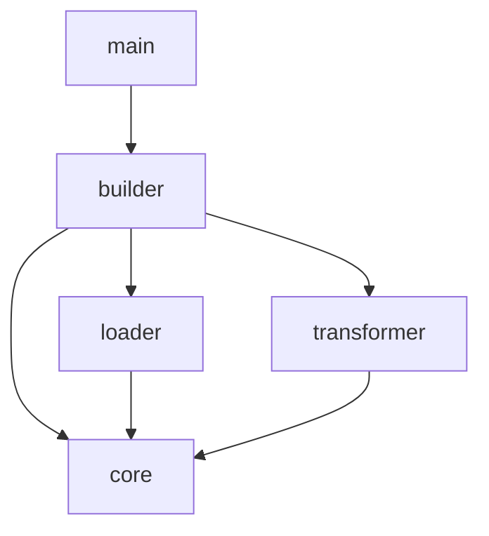

# Design: Project Restructuring (Resource to Core, Loader, Builder)

## 1. 개요 (Overview)
현재 `resource` 모듈이 너무 비대해지고, 모든 모듈이 이를 참조하여 의존성 그래프의 중심이 된 상태입니다. 특히 `registry`, `emitter`, `loader`는 특정 상위 모듈(`builder`)에서만 주로 사용됨에도 불구하고 `resource`라는 공용 모듈에 묶여 있습니다.

이 설계는 `resource` 모듈을 해체하고, 역할에 따라 **`core`**, **`loader`**, **`builder`**로 분산하여 모듈 간의 응집도를 높이고 결합도를 낮추는 것을 목표로 합니다.

## 2. 변경된 아키텍처 (New Architecture)

### 2.1. 모듈별 역할 및 책임
| 모듈 | 설명 | 주요 컴포넌트 |
| :--- | :--- | :--- |
| **`core`** | 시스템 전역에서 사용하는 공용 모델 및 타입 | `Resource`, `BuildTarget`, `ResourceData`, `TransformedFile` |
| **`loader`** | 파일 시스템에서 리소스를 스캔, 파싱하여 `core` 모델로 로드 | `ResourceLoader`, `FileFilter`, `Parser`, `Resolver` |
| **`builder`** | 전체 빌드 파이프라인 제어 및 결과물 출력 | `Builder`, `Config`, `Registry`, `Emitter` |
| **`transformer`** | `core` 모델을 받아 타겟 포맷으로 변환 | `Transformer`, `GeminiTransformer` |

### 2.2. 모듈 의존성 그래프 (Dependency Graph)

## 3. 상세 구조 (Detailed Structure)

### 3.1. `src/core/` (신규)
모든 모듈이 참조하는 기초 데이터 레이어입니다.
- `src/core/mod.rs`: 모듈 정의 및 모델 export.
- `src/core/model.rs`: `src/resource/model.rs`의 내용을 이동.

### 3.2. `src/loader/` (승격)
`src/resource/loader/`를 최상위 모듈로 승격합니다.
- `src/loader/mod.rs`: `ResourceLoader` 구현.
- `src/loader/filter.rs`, `src/loader/parser.rs`, `src/loader/resolver.rs`: 기존 로더 서브 모듈 이동.

### 3.3. `src/builder/` (재구조화)
기존 `resource`에서 빌더 전용 로직을 흡수합니다.
- `src/builder/registry.rs`: `src/resource/registry.rs` 이동.
- `src/builder/emitter.rs`: `src/resource/emitter.rs` 이동.
- `src/builder/mod.rs`: `Registry`, `Emitter`를 서브 모듈로 포함하고 전체 흐름 제어.

## 4. 데이터 흐름의 변화 (Data Flow Changes)
기존에는 `builder`가 `resource`라는 하나의 거대 모듈과 통신했다면, 이제는 다음과 같이 명확한 계층을 가집니다.

1. **Scan & Parse**: `builder`가 `loader`를 호출하여 `core::Resource` 목록을 획득.
2. **Register**: `builder`가 내부 `Registry`에 `Resource`를 등록 (중복 검사).
3. **Transform**: `builder`가 `transformer`를 호출하여 `core::TransformedFile`로 변환.
4. **Emit**: `builder`가 내부 `Emitter`를 사용하여 파일을 디렉터리에 기록.

## 5. 기대 효과 (Benefits)
- **응집도 향상**: `registry`와 `emitter`가 실제로 사용되는 `builder` 내부로 이동하여 관련 로직이 집중됨.
- **결합도 감소**: `loader`가 독립적인 모듈이 되어, 향후 빌드 파이프라인 외의 다른 용도(예: 린터, 분석 도구)로 재사용 가능.
- **확장성**: `core` 모듈에 공용 Trait이나 상수를 추가하기 용이한 구조 확보.
