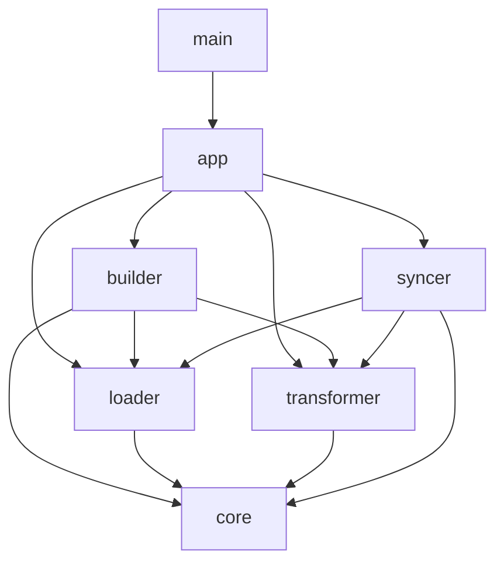

# System Design

## 1. 시스템 아키텍처 (Architecture)

`agb`는 **파이프라인 아키텍처**를 따르며, `builder` 모듈이 전체 공정을 오케스트레이션합니다.

### 1.1 빌드 파이프라인 (Build Pipeline)

`agb`의 빌드 과정은 총 5단계의 순차적인 파이프라인을 거쳐 수행됩니다.

1. **설정 로드 (Load Config)**: `agb.yaml`을 읽어 빌드 컨텍스트(소스 경로, 타겟 에이전트 등)를 생성합니다. (`builder/config.rs`)
2. **리소스 스캔 및 로드 (Scan & Load)**: 소스 경로 내의 플러그인 구조를 분석하여 파일들을 수집하고, 이를 `core::Resource` 객체로 로드합니다. (`loader` 모듈)
3. **검증 및 등록 (Validate & Register)**: 로드된 리소스들의 이름 충돌 여부를 확인하고, 빌드 대상 리소스를 `core::registry::Registry`에 등록합니다. 타입과 이름을 모두 고려하여 중복을 체크합니다.
4. **포맷 변환 (Transform)**: 설정된 타겟(`BuildTarget`) 규격에 맞춰 각 리소스를 실제 파일 포맷(TOML, Markdown FM 등)으로 변환합니다. (`transformer` 모듈 사용)
5. **최종 배포 (Emit)**: 기존 출력 디렉터리를 정리(Clean)한 후, 변환된 리소스들을 물리적 파일로 작성합니다. (`builder::emitter::Emitter`)

### 1.2 동기화 파이프라인 (Sync Pipeline)

`agb sync` 과정은 타겟의 변경사항을 소스로 역전파합니다.

1. Registry 로딩: Loader를 사용해 소스 기준의 Registry를 구축합니다.
2. 타겟 리소스 역변환 (De-transformation): 타겟 결과물을 읽어 내부 모델로 복원합니다. (`Transformer::detransform`)
3. 비교 및 반영 (Diff & Apply): 소스와 타겟을 비교하여 Surgical Update(.md) 또는 디렉터리 동기화(Skill)를 수행합니다.

### 1.3 모듈 구조 (Module Structure)

| 모듈 경로 | 설명 | 상세 문서 |
| :--- | :--- | :--- |
| `src/main.rs` | CLI 엔트리포인트 (Thin Wrapper) | - |
| `src/app/` | 실행 컨텍스트(AppContext) 및 실행 제어(App) | [`README.md`](../src/app/README.md) |
| `src/core/` | 시스템 전역 공용 모델 및 리소스 레지스트리 | [`README.md`](../src/core/README.md) |
| `src/loader/` | 리소스 스캔 및 로드 로직 | [`README.md`](../src/loader/README.md) |
| `src/builder/` | 리소스 빌드 유틸리티 및 Emitter | [`README.md`](../src/builder/README.md) |
| `src/syncer/` | 타겟-소스 동기화 엔진 및 Diff 로직 | [`README.md`](../src/syncer/README.md) |
| `src/transformer/` | 타겟별 포맷 변환 및 역변환(Detransform) | [`README.md`](../src/transformer/README.md) |
| `src/utils/` | 파일 시스템 및 포맷 처리 유틸리티 | [`README.md`](../src/utils/README.md) |

### 1.4 모듈 의존성 그래프 (Dependency Graph)

## 2. 데이터 모델 및 상세 설계

### 2.1 Core 데이터 모델 (`src/core/model.rs`)
리소스는 순수 도메인 및 빌드 결과물을 표현하는 모델들로 구성됩니다.
- **주요 타입**:
  - `BuildTarget`: 빌드 대상 플랫폼 (Gemini, Claude, OpenCode). 타겟별 예약어 및 규격 문자열 제공.
  - `Resource`: `Command`, `Agent`, `Skill` 타입을 지원하는 Enum. `Skill` 타입은 `SkillData` 구조체를 포함하여 추가 파일 정보(`extras`)를 가질 수 있습니다.
  - `ResourceData`: `name`, `plugin`, `content` (Markdown), `metadata` (`serde_json::Value`), `source_path` (`PathBuf`)
  - `ExtraFile`: 복사되어야 하는 추가 파일 정보 (`source`, `target` 경로).
  - `TransformedResource`: 변환된 결과물 묶음으로 `files` (변환된 텍스트 파일들)와 `extras` (단순 복사될 파일들)를 포함.

### 2.2 Loader 내부 모델 (`src/loader/mod.rs`)
파일 시스템 스캔 및 파싱 과정의 내부 상태를 관리합니다.
- **ScannedResource**: 파일 스캔 단계에서 생성되며 `plugin`, `name`, `paths`(`ScannedPaths`) 정보를 담습니다.
- **ScannedPaths**: 리소스 타입별 파일 경로 구성을 강제하는 Enum (예: `Skill`의 경우 `md`, `metadata`, 그리고 `extras` 목록 포함).

### 2.3 리소스 처리 파이프라인
분산된 소스 파일들을 읽어 하나의 `Resource` 객체로 완성하는 조립 과정을 담당합니다.
- **Metadata Merge**: `ResourceParser`는 `BuildTarget` 정보를 활용하여 Markdown Frontmatter와 외부 YAML 설정을 병합합니다. 외부 YAML 파일이 존재하는 경우에만 타겟별 오버라이트 로직이 활성화됩니다. (`merge_metadata` 로직)
- **Extra Files**: `Skill` 타입 리소스 폴더 내의 `SKILL.md`와 `SKILL.yaml`을 제외한 모든 파일은 `extras`로 분류되어, 변환 단계 후 Emitter에 의해 물리적으로 대상 폴더에 복사됩니다.
