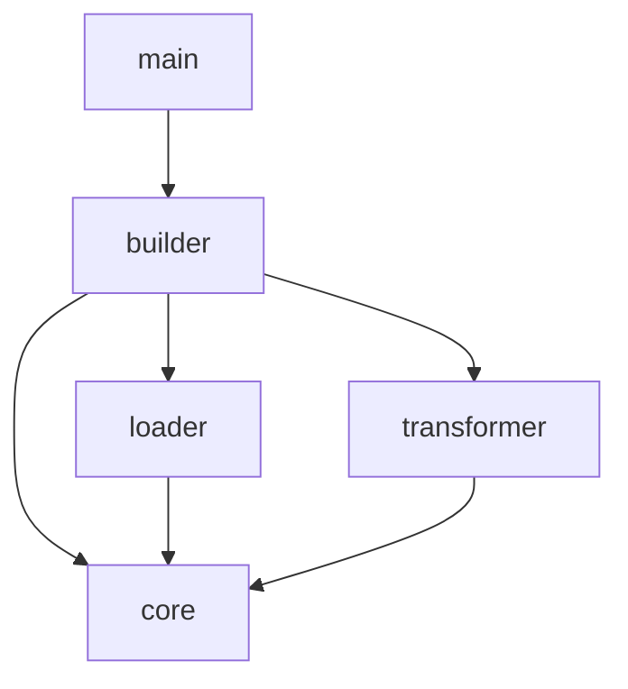

# System Design

## 1. 시스템 아키텍처 (Architecture)

`agb`는 **파이프라인 아키텍처**를 따르며, `builder` 모듈이 전체 공정을 오케스트레이션합니다.

### 1.1 데이터 흐름 (Data Flow)

1. **Load Config**: `agb.yaml`을 읽어 빌드 컨텍스트를 생성합니다. (`builder/config.rs`)
2. **Scan & Load**: 소스 경로의 플러그인을 스캔하고 `core::Resource` 객체로 로드합니다. `loader` 모듈이 이 역할을 담당합니다.
3. **Validate & Register**: 리소스 이름 충돌을 검증하고 `builder::registry::Registry`에 등록합니다.
4. **Transform**: 선택된 타겟(`BuildTarget`)에 맞는 `Transformer`가 리소스를 변환합니다. (`transformer/`)
5. **Emit**: 기존 결과물을 정리(Clean)하고 변환된 파일을 `builder::emitter::Emitter`를 통해 물리적 경로에 작성합니다.

### 1.2 모듈 구조 (Module Structure)

| 모듈 경로 | 설명 |
| :--- | :--- |
| `src/main.rs` | CLI 엔트리포인트 및 실행 제어 |
| `src/core/` | 시스템 전역 공용 모델(`model.rs`) 및 상수(`constants.rs`) 정의 |
| `src/loader/` | 파일 시스템 리소스 스캔, 필터링, 파싱 및 로드 로직 |
| `src/builder/` | 빌드 파이프라인 제어, 설정(`config`), 등록(`registry`), 출력(`emitter`) |
| `src/transformer/` | 타겟별 포맷 변환 로직 (Gemini, Claude, OpenCode) |
| `src/utils/` | 파일 시스템 조작 등 공통 유틸리티 | [`src/utils/README.md`](../src/utils/README.md) |

### 1.3 모듈 의존성 그래프 (Dependency Graph)

## 2. 데이터 모델 및 상세 설계

### 2.1 리소스 모델 (`Resource`)
리소스는 `ResourceData` 구조체를 포함하며, `Enum`을 통해 타입을 구분합니다.
- **주요 타입**:
  - `BuildTarget`: 빌드 대상 플랫폼 (Gemini, Claude, OpenCode)
  - `Resource`: `Command`, `Agent`, `Skill` 타입을 지원하는 Enum
  - `ResourceKey`: 리소스 식별자 (plugin, type, name)
  - `ResourcePaths`: 리소스를 구성하는 파일 경로들의 집합
- **ResourceData 구성**: `name`, `plugin`, `content` (Markdown), `metadata` (`serde_json::Value`)
