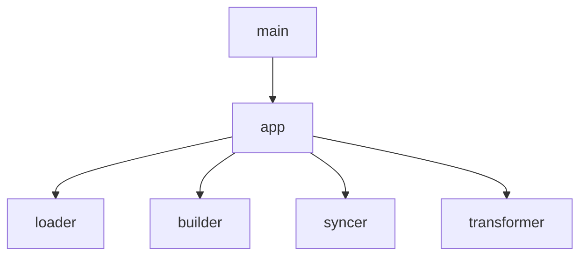
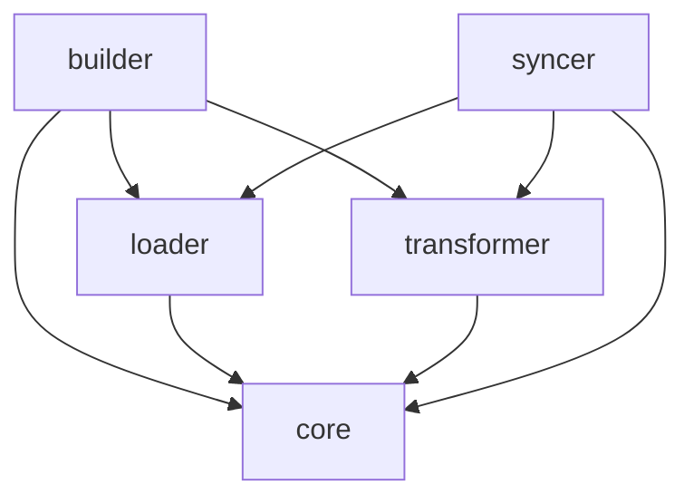

# System Design

## 1. 시스템 아키텍처 (Architecture)

`agb`는 **파이프라인 아키텍처**를 따르며, `builder` 모듈이 전체 공정을 오케스트레이션합니다.

### 1.1 빌드 파이프라인 (Build Pipeline)

`agb`의 빌드 과정은 순차적인 파이프라인을 거쳐 수행됩니다.

1. **설정 로드 (Load Config)**: `agb.yaml`을 읽어 빌드 컨텍스트(소스 경로, 타겟 에이전트 등)를 생성합니다. (`builder/config.rs`)
2. **리소스 스캔 및 로드 (Scan & Load)**: 소스 경로 내의 플러그인 구조를 분석하여 파일들을 수집하고, 이를 `core::Resource` 객체로 로드합니다. (`loader` 모듈)
3. **검증 및 등록 (Validate & Register)**: 로드된 리소스들의 이름 충돌 여부를 확인하고, 빌드 대상 리소스를 `loader::registry::Registry`에 등록합니다. 타입과 이름을 모두 고려하여 중복을 체크합니다.
4. **의존성 검증 (Dependency Check)**: 각 리소스의 `deps.yaml`을 확인하여 모든 의존 리소스가 `Registry`에 존재하는지 확인합니다. (`builder::dependency::DependencyChecker`)
5. **포맷 변환 (Transform)**: 설정된 타겟(`BuildTarget`) 규격에 맞춰 각 리소스를 실제 파일 포맷(TOML, Markdown FM 등)으로 변환합니다. (`transformer` 모듈 사용)
6. **최종 배포 (Emit)**: 기존 출력 디렉터리를 정리(Clean)한 후, 변환된 리소스들을 물리적 파일로 작성합니다. (`builder::emitter::Emitter`)

### 1.2 동기화 파이프라인 (Sync Pipeline)

`agb sync` 과정은 타겟의 변경사항을 소스로 역전파합니다.

1. Registry 로딩: Loader를 사용해 소스 기준의 Registry를 구축합니다.
2. 타겟 리소스 역변환 (De-transformation): 타겟 결과물을 읽어 내부 모델로 복원합니다. (`Transformer::detransform`)
3. 비교 및 반영 (Diff & Apply): 소스와 타겟을 비교하여 Partial Update(.md) 또는 디렉터리 동기화(Skill)를 수행합니다.

### 1.3 모듈 구조 (Module Structure)

| 모듈 경로 | 설명 | 상세 문서 |
| :--- | :--- | :--- |
| `src/main.rs` | CLI 엔트리포인트 (Thin Wrapper) | - |
| `src/app/` | 실행 컨텍스트(AppContext) 및 실행 제어(App) | [`README.md`](../src/app/README.md) |
| `src/core/` | 시스템 전역 공용 모델 및 리소스 레지스트리 | [`README.md`](../src/core/README.md) |
| `src/loader/` | 리소스 스캔 및 로드 로직 (Merger 포함) | [`README.md`](../src/loader/README.md) |
| `src/builder/` | 리소스 빌드 유틸리티 및 Emitter | [`README.md`](../src/builder/README.md) |
| `src/syncer/` | 타겟-소스 동기화 엔진 및 Diff 로직 | [`README.md`](../src/syncer/README.md) |
| `src/transformer/` | 타겟별 포맷 변환 및 역변환(Detransform) | [`README.md`](../src/transformer/README.md) |
| `src/utils/` | 파일 시스템 및 포맷 처리 유틸리티 | [`README.md`](../src/utils/README.md) |

### 1.4 모듈 의존성 그래프 (Dependency Graph)

#### 1.4.1 애플리케이션 계층 (App Layer)

`main` 및 `app` 모듈이 다른 하위 모듈들을 오케스트레이션하는 구조입니다.

#### 1.4.2 모듈 간 내부 의존성 (Module Dependencies)

각 하위 모듈들이 서로를 참조하거나 공용 `core` 모듈을 참조하는 구조입니다.

## 2. 데이터 모델 및 상세 설계

상세한 Rust 타입 정의와 모델 구조는 [**model.md**](./model.md)를 참조하십시오.

### 2.1 핵심 모델 개요

- **Resource**: `Command`, `Agent`, `Skill` 타입을 지원하는 핵심 도메인 모델입니다. `Skill` 타입은 추가 파일 정보(`extras`)를 포함할 수 있는 `SkillData` 구조체를 가집니다.
- **BuildTarget**: 빌드 대상 플랫폼(Gemini, Claude, OpenCode)을 나타내며, 각 타겟별 예약어 및 규격 정보를 관리합니다.
- **TransformedResource**: 변환이 완료된 최종 결과물로, 텍스트 파일(`files`)과 물리적 복사 대상(`extras`)을 포함합니다.

### 2.2 내부 상태 관리 (Loader & Registry)

- **ScannedResource**: 파일 시스템 스캔 단계에서 생성되는 원시 데이터로, 플러그인과 파일 경로 구성을 담습니다.
- **Registry**: 로드 및 검증이 완료된 `Resource` 객체들을 메모리에 보관하는 중앙 저장소입니다. 리소스의 타입과 이름에 대한 충돌을 검증합니다.

### 2.3 리소스 충돌 정책 (Conflict Policy)

`agb`는 빌드 결과물의 예측 가능성을 보장하기 위해 엄격한 이름 충돌 방지 정책을 가집니다.

- **동일 타입 충돌**: 동일한 리소스 타입(예: Command) 내에서 이름이 중복되는 경우, 소속된 플러그인이 다르더라도 빌드를 즉시 중단합니다.
- **교차 타입 허용**: 서로 다른 리소스 타입(예: Command 'foo'와 Skill 'foo')은 동일한 이름을 가질 수 있습니다. 이는 에이전트별로 리소스 종류에 따라 저장 경로가 구분되기 때문입니다.

### 2.4 리소스 처리 파이프라인

분산된 소스 파일들을 읽어 하나의 `Resource` 객체로 완성하는 조립 과정을 담당합니다.

- **Metadata Merge & Map**: `loader::merger::MetadataMerger`는 `BuildTarget`과 소스 루트의 `map.yaml` 정보를 활용하여 메타데이터를 통합합니다.
    - **Mapping**: Frontmatter 필드 값을 타겟에 맞게 치환합니다.
    - **Override**: 외부 YAML 파일의 타겟 전용 섹션 내용을 최종적으로 덮어씁니다.
- **Extra Files**: `Skill` 타입 리소스 폴더 내의 `SKILL.md`와 `SKILL.yaml`을 제외한 모든 파일은 `extras`로 분류되어, 변환 단계 후 Emitter에 의해 물리적으로 대상 폴더에 복사됩니다.

## 3. 상세 알고리즘 및 처리 로직

### 3.1 메타데이터 병합 상세 로직

`loader::merger::MetadataMerger`는 다음 단계를 통해 최종 메타데이터를 조립합니다.

1.  **Extract Base**: `.md` 파일의 YAML Frontmatter에서 공용 필드를 추출합니다.
2.  **Apply Mapping (Optional)**: `map.yaml` 정의에 따라 필드 값을 타겟에 맞게 치환합니다.
3.  **External Process (Optional)**: 외부 메타데이터 파일(`.yaml`/`.yml`)에서 타겟 전역 예약어 섹션(`gemini-cli` 등)만 추출하여 기존 값을 덮어씁니다. (상세 오버라이트 로직)
4.  **Cleanup**: 최종 객체에서 모든 타겟 예약어 키들을 제거하여 깨끗한 메타데이터 객체를 완성합니다.

### 3.2 의존성 검증 시점

의존성 검증(`DependencyChecker`)은 빌드 파이프라인의 **Transform 단계 직전**에 수행됩니다. 모든 리소스가 메모리에 로드되고 Registry에 등록된 후, 실제 파일 변환이 시작되기 전에 정적 검증을 완료하여 Fail-fast를 보장합니다.

### 3.3 동기화 패치 알고리즘 (MdPatcher)

`syncer::patcher::MdPatcher`는 원본 파일의 구조(주석, 필드 순서 등)를 보존하기 위해 다음 방식을 사용합니다.

- **정규표현식 기반 교체**: YAML 파서 대신 특정 필드(`description`)를 찾는 정규표현식을 사용하여 해당 라인만 교체합니다.
- **멀티라인 처리**: YAML 멀티라인 마커(`|`, `>`)나 들여쓰기가 감지되면 파싱의 복잡성과 원본 파손 위험을 방지하기 위해 작업을 중단하고 에러를 반환합니다.
